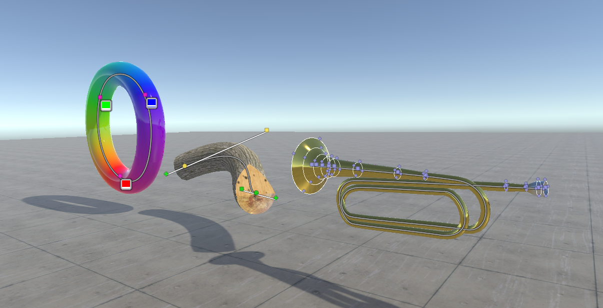

# Curve Designer
A free tool for designing tubes, ramps, curves, and half-pipes in Unity.

# Usage
Simply attach the Curve3D.cs script to a GameObject and select the it in the scene view. Make sure you have gizmos enabled! You can click the curve to add new points, and click+drag points to move them around.

Curves have parameters to control rotation, color, size, etc. By default all of the curve's parameters are constant along the length of the curve, however using the dropdown next to these properties you can switch them from "constant" to "curve". Now if you click on the curve you'll be able to place points which control the value of these properties along the curve.

# Downloads
You can download the most up-to-date version from https://github.com/cmacmillan/CurveDesigner

You can also grab it from the asset store https://assetstore.unity.com/packages/slug/200130

# Bugs
You can either submit issues to https://github.com/cmacmillan/CurveDesigner/issues or email me directly support@chasemacmillan.com
