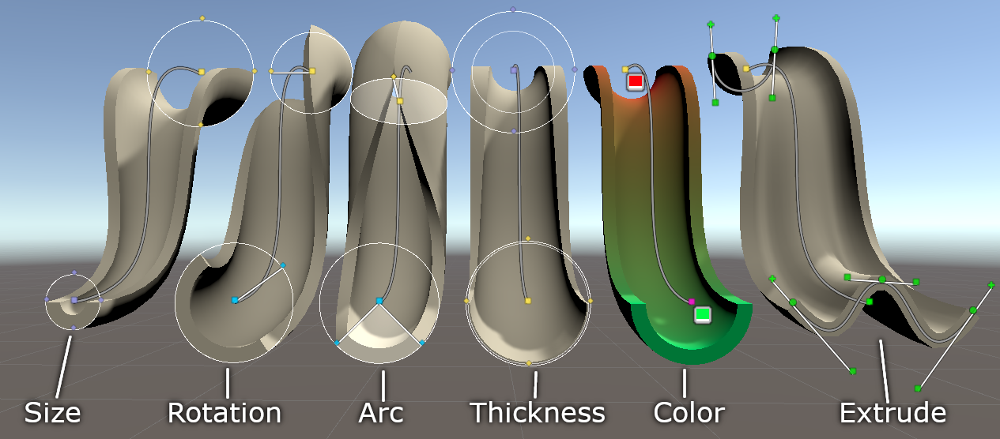
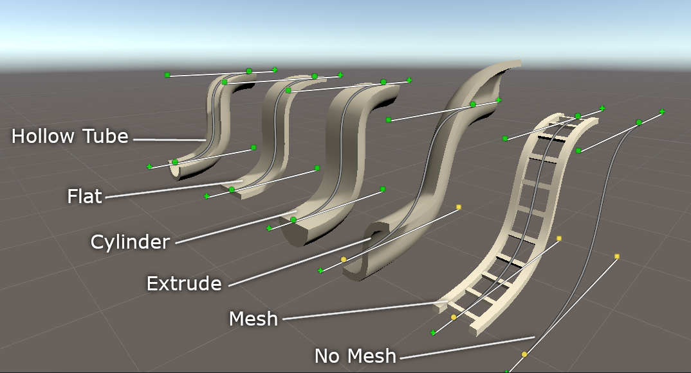

# Curve Designer
An open source (MIT) tool for designing tubes, ramps, curves, and half-pipes in Unity. 

# Usage
See UserManual.pdf for a full user guide.

# Downloads
You can download the most up-to-date version from https://github.com/cmacmillan/CurveDesigner

You can also grab it from the asset store https://assetstore.unity.com/packages/slug/200130

# Bugs
You can either submit issues to https://github.com/cmacmillan/CurveDesigner/issues or email me directly support@chasemacmillan.com
